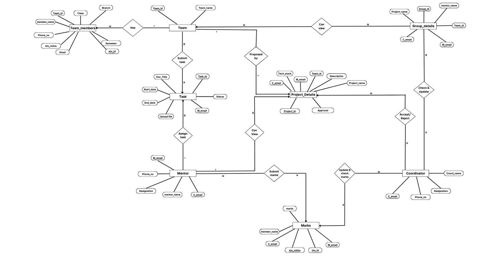
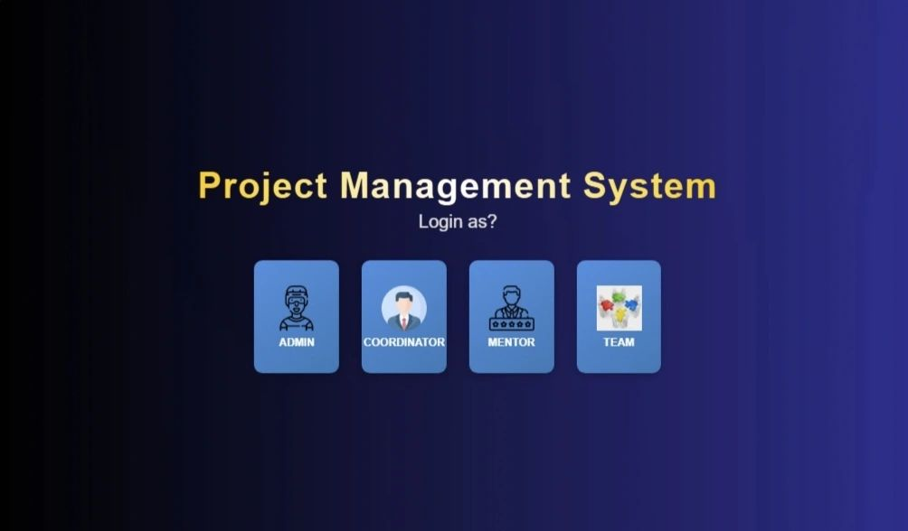

# 🧭 Project Management System (PMS)

A full-stack **web-based Project Management System** designed for academic institutions to streamline project handling, communication, and evaluation between **Coordinators, Mentors, and Student Teams**.  
Developed as part of the Department of Computer Science, **Banasthali Vidyapith**.

---

## 📘 Overview

The **PMS** helps manage software projects efficiently through modules for **project planning, task tracking, file sharing, notifications, and reporting**.  
It provides distinct dashboards for coordinators, mentors, and student teams, ensuring smooth workflow, transparency, and effective communication.

---

## ⚙️ Tech Stack

| Layer | Technology |
|--------|-------------|
| **Frontend** | HTML5, CSS3, JavaScript|
| **Backend** | Python 3.9, Django 3.2|
| **Database** | MySQL 8.0 |
| **Version Control** | Git & GitHub |
| **Communication** | HTTPS |

---

## 🧩 System Features

### 👨‍💼 1. Project Planning
- Teams can create and describe projects.
- Coordinators can approve or reject proposals.
- Teams are notified upon approval or rejection.

### 📝 2. Task Management
- Mentors create and assign tasks with deadlines.
- Teams upload deliverables for review.
- Automatic notifications for task submissions and updates.

### 📁 3. File Sharing
- Secure document and media uploads.
- Role-based file access for coordinators, mentors, and teams.
- Versioning and multi-format support (PDF, DOCX, Images, etc.).

### 👥 4. Team & Group Management
- Coordinators manage teams and assign mentors.
- Teams can view member details and collaboration info.

### 🔔 5. Notifications
- Real-time notifications for updates, approvals, and alerts.
- Mentors and coordinators can send targeted messages to teams.

### 🐞 6. Bug Reporting
- Team members can report bugs/issues.
- Mentors and coordinators can comment and resolve issues collaboratively.

---

## 🔒 Non-Functional Requirements

- **Security:** HTTPS encryption, RBAC (Role-Based Access Control), user authentication.
- **Maintainability:** Modular architecture for easy updates.
- **Reliability:** Backup mechanism to preserve data integrity.

---

## 🧱 Database Schema

### Main Tables
- **Team_members:** student details with team association  
- **Team:** team ID and name  
- **Group_Details:** links mentors, coordinators, and teams  
- **Marks:** stores evaluation data  
- **Project_Details:** project info, approval status, tech stack  
- **Task:** task details, uploads, and dates  
- **Mentor / Coordinator:** mentor and coordinator data  

Each table is linked through primary and foreign keys ensuring referential integrity.

---
 

### 🧠 Design Diagrams
 **ER Diagram**

---

## 🖥️ Screenshots

